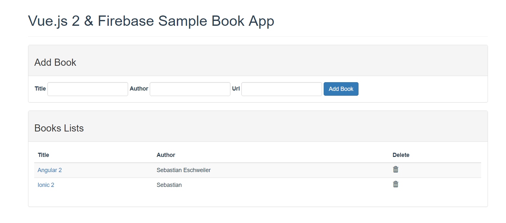

# Vue.js 2 & Firebase - Building Real Time Single Page Web Applications


Build a simple book list app that uses a Firebase realtime database as a backend and Vue.js 2 for a view layer.




## Build Setup

``` bash
# install dependencies
npm install

# serve with hot reload at localhost:8080
npm run dev

# build for production with minification
npm run build

# build for production and view the bundle analyzer report
npm run build --report
```
